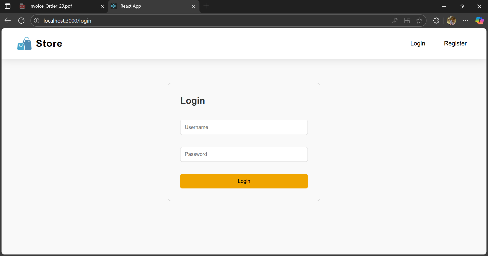

# 🛒 E-Commerce Appliances Store

   


## **Project Overview**

This is a full-stack **e-commerce web application for appliances**, allowing users to:

* Browse, search, and filter home and kitchen appliances
* Add products to the cart with real-time updates
* See promotional banners with **5–10% OFF discounts**
* Experience a **responsive, modern UI**

---

## **Technologies Used**

* **Frontend:** React.js, HTML, CSS
* **Backend:** Django REST Framework
* **Database:** SQLite/MySQL
* **APIs:** RESTful APIs for products and cart

---

## **Setup Instructions**

### **Backend Setup (Django)**

```bash
git clone <your-repo-url>
cd <your-project-folder>
python -m venv env      # Create virtual environment
# Activate environment
# Windows:
env\Scripts\activate
# Linux/Mac:
source env/bin/activate
pip install -r requirements.txt   # Install dependencies
python manage.py migrate           # Run migrations
python manage.py runserver         # Start backend server
```

Backend runs at: `http://127.0.0.1:8000/`

---

### **Frontend Setup (React)**

```bash
cd frontend
npm install        # Install dependencies
npm start          # Start frontend server
```

Frontend runs at: `http://localhost:3000/`

---

## **Project Structure**

```
/frontend
  ├── src
      ├── components
      ├── pages
      ├── api
      └── Home.css
/backend
  ├── manage.py
  ├── app
      ├── models.py
      ├── views.py
      └── urls.py
      |_requirements.txt 
```

---

## **Features**

* 🏷 Browse products by **category** and **price range**
* 🔍 Dynamic **search functionality**
* 🛒 **Add-to-cart** with real-time updates
* 🎯 **Promotional banners** with discount badges
* 📱 Fully **responsive layout** for mobile and desktop
* ✨ Smooth **hover effects** on buttons and cards

---

## **Screenshots**

### **1. Homepage**


## **Authentication**



### **2. Product Listing**


### **3. Cart Page**


### **4. checkout Page**


### **5. creditcard  Page**


### **5. paymentsuccess Page**


### **5. order Page**


### **5. invoice Page**


## **Usage**

1. Open frontend: `http://localhost:3000/`
2. Browse products or use **search/filter options**
3. Click “Shop Now” or “Explore Deals” banners
4. Add products to cart and view items

